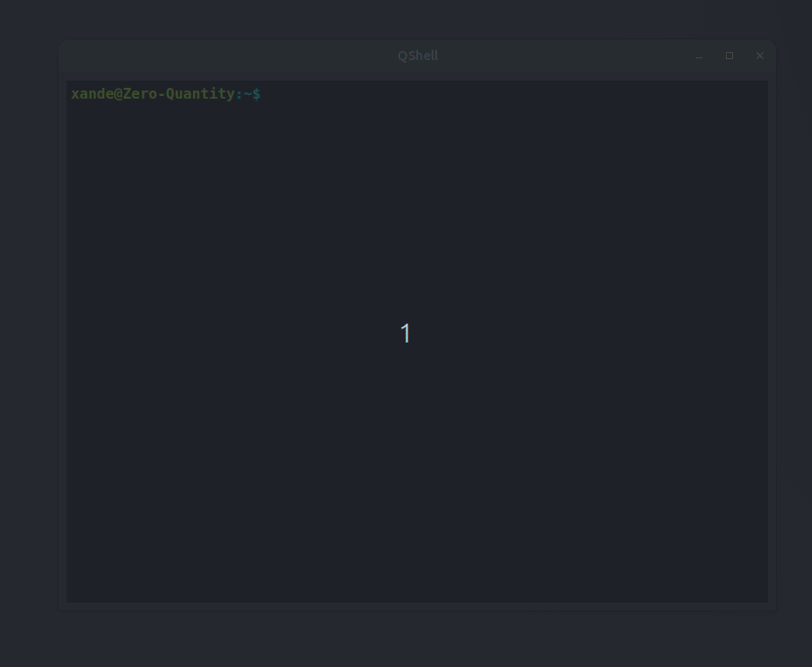

# QShell
QShell is a lightweight Linux terminal emulator built using [Qt 6](https://www.qt.io/).


---

## Summary
QShell is a Qt-powered GUI terminal that emulates classic Linux shell behavior.  
It supports basic filesystem commands, colored output, and prompt history – all with a clean, stylized interface.

---

## Preview


---

## Features
- Shell prompt rendering.
- Shell command execution via [`QProcess`](https://doc.qt.io/qt-6/qprocess.html).
- Directory and file color formatting.
- Command history support.
- Clear screen behavior (`Ctrl+L`).
- Manual pages.
- Handles basic shell-like commands: `mkdir`, `touch`, `rm`, `rmdir`, `mv`, `cat`, etc.

---

## Requirements
- [Qt 6.8.0](https://www.qt.io/)
- [CMake ≥ 3.28](https://cmake.org/)
- [GCC ≥ 13 (with C++20)](https://gcc.gnu.org/)
- A Linux-based environment (tested on **Ubuntu 24.04**)

---

## Build with CMake

### 1. Clone the repository
```bash
git clone https://github.com/Road-to-embedded/QShell.git
cd QShell
```

### 2. Build with [CMake](https://cmake.org/)
```bash
mkdir build && cd build
cmake ..
make
```

> If Qt is installed in a custom location:
```bash
cmake .. -DCMAKE_PREFIX_PATH=/home/xande/Qt/6.8.0/gcc_64/lib/cmake
```

---

## Run QShell
```bash
./qshell
```
> Make sure you're inside the `build/` directory when running.

---

## Built With
- [Qt 6.8.0](https://www.qt.io/) — GUI framework
- [C++20](https://en.cppreference.com/w/cpp/20) — Language standard
- [CMake](https://cmake.org/) — Build system
- [QProcess](https://doc.qt.io/qt-6/qprocess.html) — For managing shell commands
- [QTextEdit](https://doc.qt.io/qt-6/qtextedit.html) — For the terminal interface

---

## Future Add-ons
- Tab-based interface with multiple terminal tabs.
- Command auto-completion.
- Global theme settings (light/dark).
- Mouse-based copy-paste support.
- Command history navigation (up/down arrows).
- Full support for piping and redirections.


